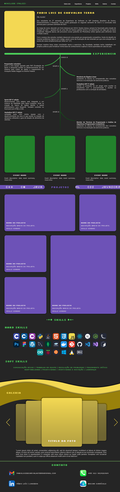

# Site de Portfólio

Este repositório contém o código-fonte e referências de design para o meu **site pessoal de portfólio**.  
O objetivo principal deste projeto é apresentar minhas habilidades, experiências e projetos de forma profissional e interativa.

---

## Protótipo

O design foi criado no **Figma** e serve como base para a implementação do site.  

---