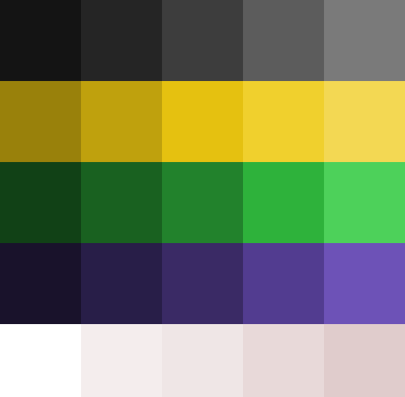

# 🎨 Paleta de Cores do Projeto

## 1. Escala de Cinza (Neutros Escuros)

| Hexadecimal | Descrição                       |
| :---------: | :------------------------------ |
| **#0F1112** | Preto Profundo (Fundo/Texto)    |
| **#242526** | Cinza Chumbo                    |
| **#3D3D3E** | Cinza Escuro                    |
| **#59595A** | Cinza Médio                     |
| **#7D7D7D** | Cinza Claro (Desativado/Bordas) |

## 2. Tons de Amarelo (Destaques)

| Hexadecimal | Descrição                    |
| :---------: | :--------------------------- |
| **#9C7E09** | Ocre Escuro                  |
| **#CFB413** | Dourado                      |
| **#EBC513** | Amarelo Ouro (Primária)      |
| **#F4D334** | Amarelo Solar                |
| **#F9DE57** | Amarelo Pastel (Fundo Claro) |

## 3. Tons de Verde (Sucesso/Ação)

| Hexadecimal | Descrição                 |
| :---------: | :------------------------ |
| **#15461F** | Verde Floresta            |
| **#1F6728** | Verde Bandeira            |
| **#278A31** | Verde Grama               |
| **#32B441** | Verde Limão               |
| **#4ED363** | Verde Neon (Botões/Links) |

## 4. Tons de Roxo (Criativo/Secundário)

| Hexadecimal | Descrição          |
| :---------: | :----------------- |
| **#17152B** | Índigo Quase Preto |
| **#26214B** | Roxo Profundo      |
| **#382F6F** | Roxo Azulado       |
| **#503EA0** | Violeta            |
| **#715CC7** | Lilás Vibrante     |

## 5. Tons Neutros Claros (Fundos/UI)

| Hexadecimal | Descrição           |
| :---------: | :------------------ |
| **#FFFFFF** | Branco Puro         |
| **#F3F0F0** | Off-White / Gelo    |
| **#EFE8EA** | Cinza Rosado Pálido |
| **#E8D8D8** | Bege Rosado         |
| **#DFCFCF** | Cinza Quente        |

---
